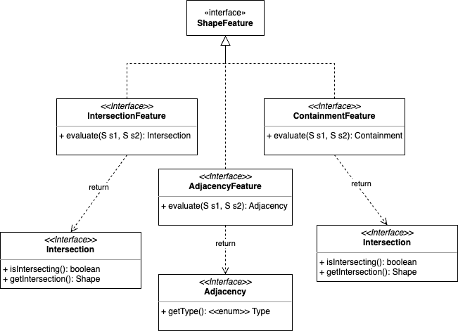

# Rectangle Features
Some common algorithms over rectangle shapes.  This projects provides implementation a set of algorithms based on rectangles.  Although, the underlying framework was created
for scaling features to any shape and adding more algorithms, the current implementation is limited to rectangles.  The algorithms are implemented in Java language.

### Prerequisites
* Java 11+
* Maven 3.3+

## Features
The following algorithms are implemented:

* **Intersection**: Calculates the intersection of two rectangles.
* **Containment**: Calculates whether one rectangle contains the other.
* **Adjacency**: Calculates the adjacency level of two rectangles.  PROPER (full adjacent by one side), PARTIAL, SUB_LINE or NONE.

## Getting Started
Run the following command to build the project:
```
mvn clean install
```

Run the class **[ShapeFeaturesApp.java](src%2Fmain%2Fjava%2Fio%2Fgithub%2Fgldiazcardenas%2Fshapefeatures%2FShapeFeaturesApp.java)** to start the application.

## Framework

The framework is highly extensible and can be used to implement algorithms for any shape. It uses plenty of Java Generics, Inheritance and Polymorphism; with ample use of **SOLID** principles.

It is composed of a set of interfaces as mentioned in the following diagram:



Apart from this set of interfaces it was introduced a Factory pattern, so the implementation of features is completely hidden.

Check the class: [ShapeFeaturesFactory.java](src%2Fmain%2Fjava%2Fio%2Fgithub%2Fgldiazcardenas%2Fshapefeatures%2FShapeFeaturesFactory.java)


## Running the tests
```
mvn test
```

